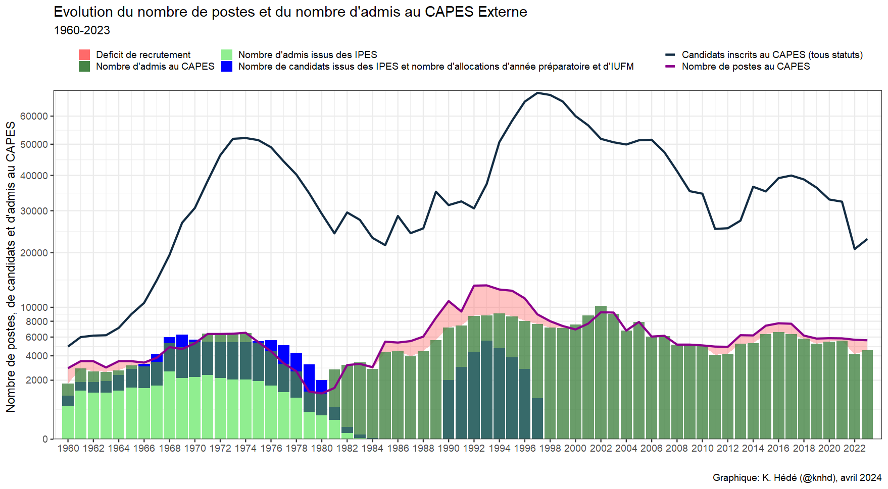

Untitled
================

## Evolution du nombre de postes et d’admis au CAPES Externe

Ce document est un exemple de page web créé pour présenter un graphique
de l’évolution du CAPES depuis 1960

## Evolution du nombre de postes et d’admis au CAPES Externe

Voici un exemple de graphique

<!-- -->

Note that the `echo = FALSE` parameter was added to the code chunk to
prevent printing of the R code that generated the plot.
